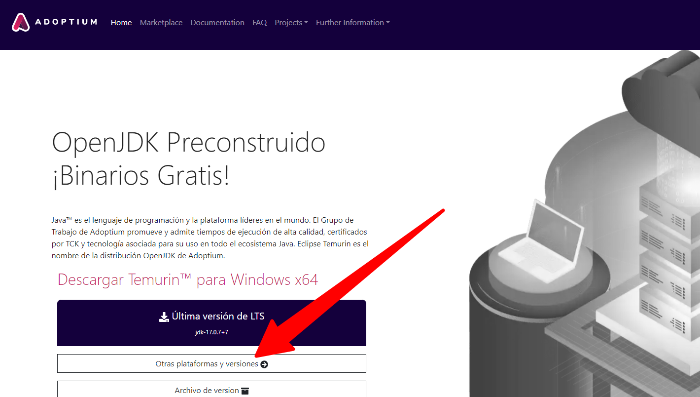
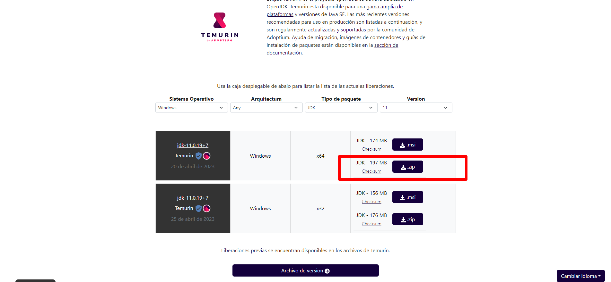
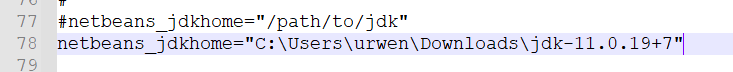
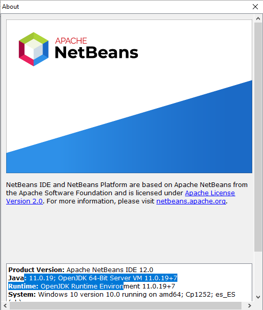
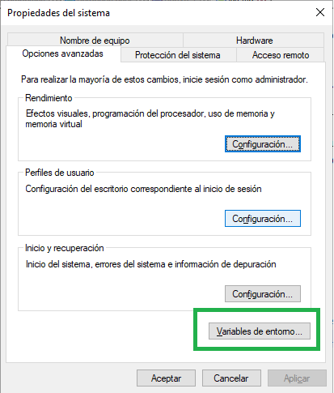
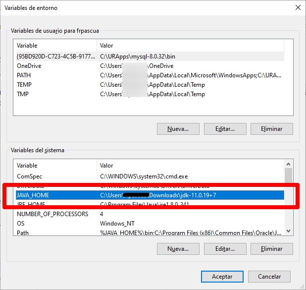
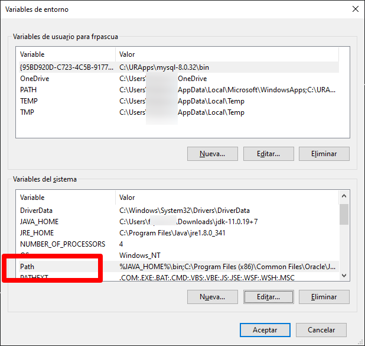
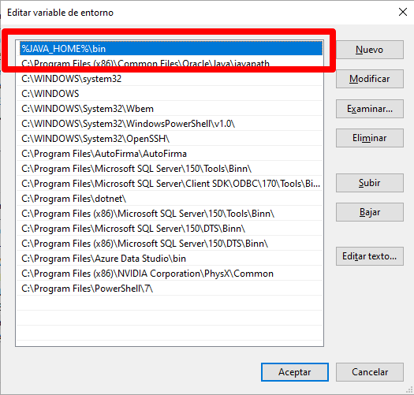

# Cambio JDK

## Cambiar JDK en NetBeans
Los siguientes pasos describen el procedimiento para cambiar la versión de JDK con la que se ejecuta NetBeans:

- Cerrar NetBeans

- Navegar a la página [https://adoptium.net](https://adoptium.net/). Elegir "Otras plataformas y versiones

- Elegir la versión JDK11 para Windows en zip

- Una vez descargado tendremos un archivo con nombre similar a "OpenJDK11U-jdk_x64_windows_hotspot_11.0.19_7.zip". Descomprimir.

- Ir a la carpeta "C:\URApps\netbeans\etc" y editar el archivo "netbeans.conf". Localizar la línea "#netbeans_jdkhome" y cambiarla para que apunte al JDK descomprimido:

- Abrir NetBeans y verificar que se está ejecutando con la versión de JDK descargada:

## Cambiar JDK en Windows
- Editar las variables de entorno del sistema

- Cambiar **variable JAVA_HOME** para que apunte a la carpeta donde tenemos el JDK descomprimido:

- Cambiar **variable PATH** para que su primera entrada sea el "bin" del nuevo JDK:

